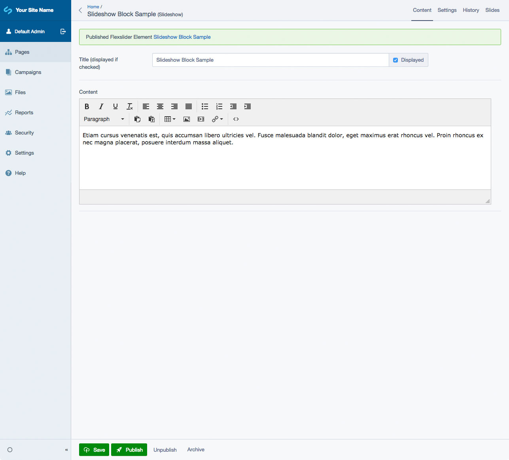
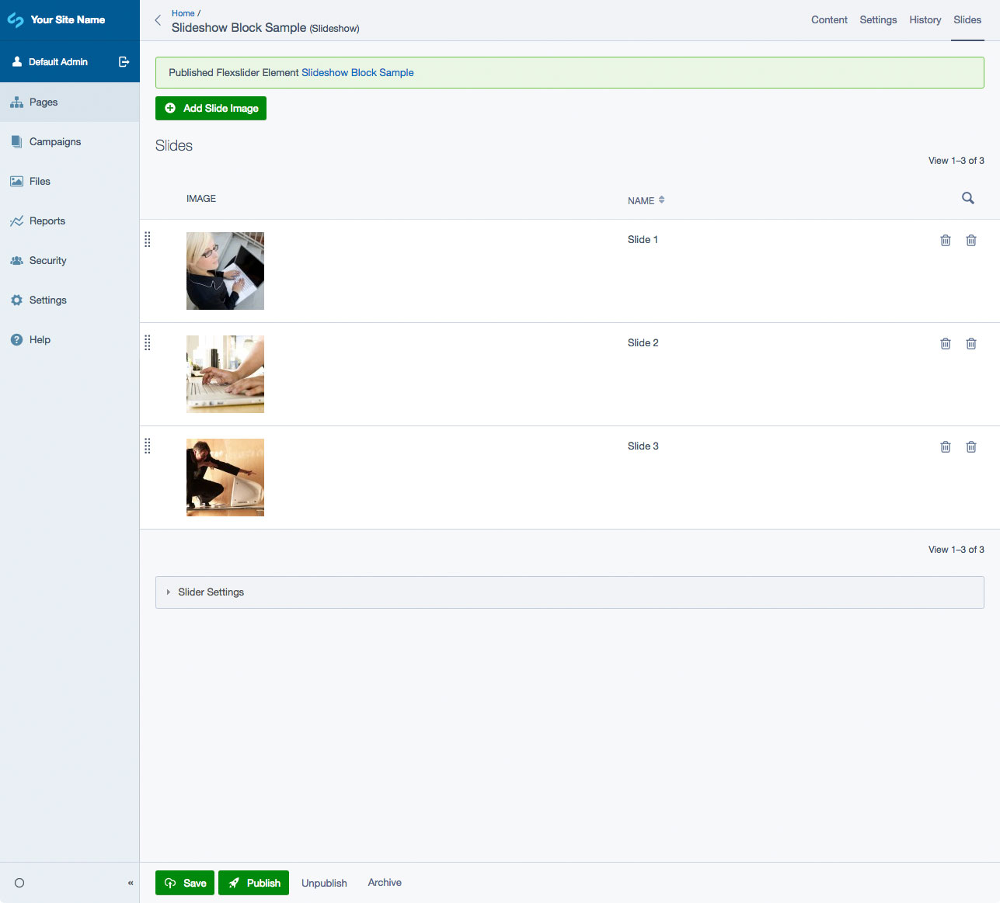

# SilverStripe Elemental Flexslider

Slideshow content block for SilverStripe Elemental

## Requirements

* silverstripe/recipe-cms: ^1@dev || ^4@dev
* dnadesign/silverstripe-elemental: ^2@dev || ^3@dev
* dynamic/flexslider: ^3@dev

## Installation

`composer require dynamic/silverstripe-elemental-flexslider`

## Example usage

A block to display a Flexslider slideshow on your page. Image, headline, description and link.

## Flexslider Options
* Slide or Fade transitions.
* Animate Automatically - Starts the slideshow on page load.
* Loop Carousel - Makes the slideshow an infinite loop instead of not being able to go next on the last slide or previous on the first slide.
* Show ControlNav - Adds the circle dots as "pagination" links.
* Show DirectionNav - Adds the arrows on the left and right sides of a slideshow for navigating.
* Thumbnail Navigation - Creates thumbnail images below the main slide show. These are also used as navigation elements to each slide.
* Show Carousel Control Navigation - Same as ControlNav above, except for the thumbnails.
* Show Carousel Direction Navigation - Same as DirectionNav above, except for the thumbnails.

## Screen Shots

#### Front End sample of a Slideshow Element

#### CMS - Slideshow Element Main Tab

#### CMS - Slideshow Element - Slides List

#### CMS - Slideshow Element - Slide Add/Edit

## Legacy migration

If you have a site using a version of this block older than 1.0.0-beta4, you will need to use the following tool to update the namespace of your records:

See [Dynamic Elemental Blocks Migrator](https://github.com/dynamic/dynamic-elemental-blocks-migrator) 

## Getting more elements

See [Elemental modules by Dynamic](https://github.com/dynamic/silverstripe-elemental-blocks#included-blocks)

## Configuration

See [SilverStripe Elemental Configuration](https://github.com/dnadesign/silverstripe-elemental#configuration)

